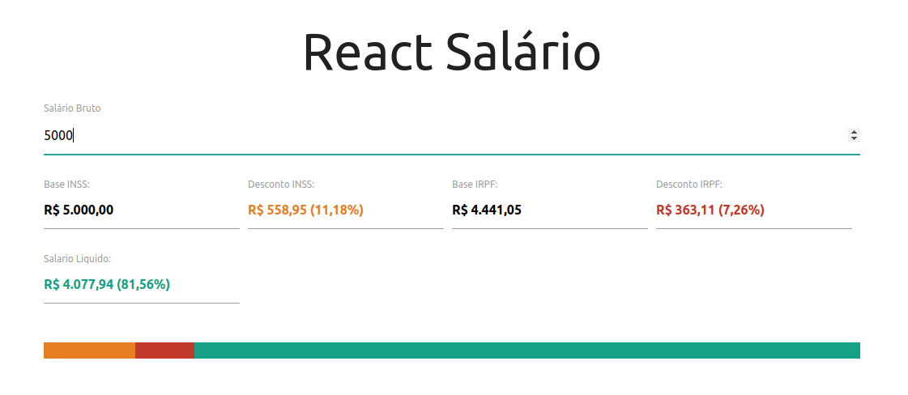

<h1 align="center">
  
</h1>

<p align="center">
  <a href="#-projeto">Projeto</a>&nbsp;&nbsp;&nbsp;|&nbsp;&nbsp;&nbsp;
  <a href="#-tecnologias">Tecnologias</a>
 </p>

<br>

## <p align="center"><b>T02-M03-IGTI</b></p>

<br>

<p align="center">
  
</p>

<br>

## 💻 Projeto

O Trabalho Prático 01 - Módulo 3 - Bootcamp FullStack IGTI (T02-M03-IGTI) é um trabalho onde é construído um mini sistema de consulta a salários, o usuário insere o salário que deseja consultar e tem as informações de quanto será descontado de INSS, IRPF e saberá também seu salário liquido no fim do mẽs...

Para iniciar a aplicação:

```bash
npm start
```

E acessar no navegador com:

```bash
http://localhost:3000/
```

<br>

## ✨ Tecnologias

Esse projeto foi desenvolvido com as seguintes tecnologias:

- HTML
- CSS
- JavaScript
- React

---
